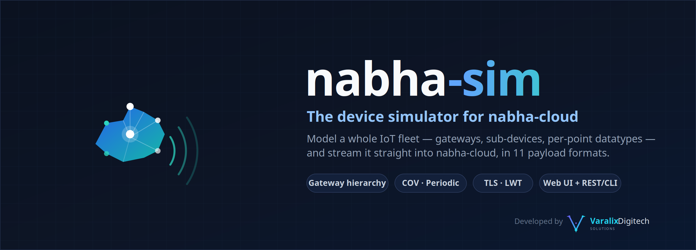

<div align="center">



# nabha-sim

### The device & fleet simulator for [nabha-cloud](https://app.nabha.cloud)

**Model a whole IoT fleet — gateways, sub-devices, per-point datatypes — then stream it straight into nabha-cloud in any of 11 payload formats. Drive it from a web UI, a REST API, or the `nsim` CLI.**

[](LICENSE)
[](https://www.python.org/)
[](https://mqtt.org/)
[](https://fastapi.tiangolo.com/)

⭐ **If nabha-sim saves you time wiring up test devices, please [star the repo](#) — it genuinely helps and takes two seconds.** ⭐

</div>

---

## What it is

**nabha-sim** is a small, self-contained simulator that lets you try
[nabha-cloud](https://app.nabha.cloud) without any real hardware. Instead of
flashing firmware onto devices to see data flow into the platform, you model
**devices** in a browser and let nabha-sim generate realistic, ticking telemetry
and stream it straight into nabha-cloud.

- **First-class devices** with a **gateway → sub-device** hierarchy, five device
  kinds (`gateway`, `direct`, `zigbee`, `enocean`, `modbus`), and preset point
  maps (EnOcean EEPs, Zigbee clusters, Modbus registers) you can freely edit.
- **Per-point simulation** — each point has a datatype (`float`/`int`/`bool`/
  `string`/`enum`) and a behavior (`walk`/`increment`/`fixed`) that ticks once a
  second. Override any value live to trigger change-of-value publishes.
- **Flexible publishing** — bind a device to a connection + topic with
  **Periodic**, **COV (change-of-value)**, or **Manual** modes; a gateway
  binding can aggregate all its children into one payload.
- **11 payload formats** — flat JSON, gateway envelope, tag array, key=value,
  CSV, Modbus float32 hex, single number, OPC-UA-style datapoints, EnOcean raw
  telegram, liveness status, or a fully custom template.
- **4 connection slots** with TLS, Last-Will-and-Testament, and MQTT v3.1 / v3.1.1 / v5.0.
- **Pinned to nabha-cloud** — connections target the nabha-cloud ingest broker
  (`mqtt.nabha.cloud:8883`, TLS); host and port are fixed, so you only bring
  your org's **username/password** and **device token** from the app's
  Connection Details panel.
- **Human- and script-friendly** — everything the web UI does is plain REST, so
  an automation/agent can drive the exact same fleet.

> [!NOTE]
> Nothing is published until you **Start** a connection and **enable** a binding.
> The seeded example bindings ship **disabled** so a fresh clone never sends to
> nabha-cloud by accident.

## ⚡ Quick start

```bash
git clone <your-fork-url> nabha-device-simulator
cd nabha-device-simulator

python3 -m venv .venv
.venv/bin/pip install -r requirements.txt

cp config.example.json config.json     # optional: seeds a few sample devices
./run.sh                               # serves http://localhost:8765
```

Open **http://localhost:8765** for the UI. Interactive API docs are at
**http://localhost:8765/api/docs**.

Runtime state persists to `config.json` (gitignored — it holds your device
tokens and topics). Delete it to start fresh; the app recreates a blank config.

## 🚀 Try it with nabha-cloud

Push a realistic fleet into [nabha-cloud](https://app.nabha.cloud) and watch it
get parsed and charted end-to-end — no hardware required:

1. Sign in at **[app.nabha.cloud](https://app.nabha.cloud)**, create a Thing
   (data source), and open its **Connection Details** panel — it shows the
   broker host/port, your org's **username + password**, and the exact
   **telemetry** and **status** topics to use.
2. In nabha-sim, open **IoT ▸ MQTT**, set Connection 1 to
   `mqtt.nabha.cloud:8883` with **TLS on** and the org **username/password**
   from the panel, then **Start** it.
3. On **Publish**, add a device (or load `config.example.json`), bind it to
   Connection 1 with topic `orgs/<your-org-id>/telemetry/<thing-token>`, format
   **Flat JSON**, QoS 1, and **enable** it.
4. (Connection LED) On Connection 1, set the **LWT topic** to
   `orgs/<your-org-id>/status/<thing-token>` with payload `offline`. The sim
   publishes `online` there automatically after each connect (birth message)
   and the broker publishes `offline` for you if the connection dies — that
   pair drives the Thing's online/offline LED in nabha-cloud instantly.
5. Open your nabha-cloud dashboard and watch the datapoints arrive live.

> Bring your own credentials — nothing secret is committed to this repo. Both
> topics and the broker login come from the Thing's Connection Details panel.

## The model

| Entity | Shape |
|--------|-------|
| **Device** | `{id, name, kind, parent, address, preset, points[]}` — set `parent` to a gateway's id to make it a sub-device |
| **Point** | `{name, datatype, sim, min, max, step, unit, decimals, values[]}` — `step` is walk size, or flip probability (0–1) for bool/enum |
| **Binding** ("Pub") | `{device, include_children, connection, topic, data_format, qos, retain, mode, interval, cov_*}` |

## Data formats

Each binding renders the device's current values into one of:

| Format | Shape |
|--------|-------|
| `flat` | Flat JSON `{point: value, …}` + `timestamp`/`quality`; sub-devices nested under their name |
| `json` | Gateway envelope with `deviceId`, `data`, and a `subDevices[]` array for demux |
| `tag_array` | Self-describing `{"d":[{"tag","value"}], "ts"}` |
| `kv` | `k=v,k=v` |
| `csv` | Positional CSV row (values only, RFC-4180 quoting) |
| `binary` | Modbus-style hex — each point packed big-endian float32 across 2 registers |
| `raw_number` | A single bare number (the first numeric point in scope) |
| `opcua` | OPC-UA-style datapoint list (`server_name`, `node_id`, `value`, `quality`, `timestamp`) |
| `raw` | EnOcean ESP3 hex telegram wrapped in a small JSON envelope |
| `status` | Liveness `{"online": true, "timestamp": …}` |
| `template` | Custom string with `{{point}} {{ts}} {{epoch}} {{epoch_ms}} {{rand(a,b)}} {{randint(a,b)}} {{bool}} {{name}} {{seq}}` |

## REST API

- `GET  /api/state` · `GET /api/logs?since=N` · `GET /api/messages`
- `PUT  /api/connections/{i}` · `POST /api/connections/{i}/start|stop`
- `POST /api/devices` (upsert; include `id` to edit) · `DELETE /api/devices/{id}`
- `POST /api/devices/{id}/point` `{name, value}` — override a live point
- `POST /api/bindings` · `DELETE /api/bindings/{id}` · `POST /api/bindings/{id}/publish`
- `POST /api/subs` · `DELETE /api/subs/{id}`
- `POST /api/publish` — one-shot; a string payload is sent as-is, so you can test malformed-JSON handling

## CLI (`nsim`)

A thin `curl` wrapper over the REST API (needs the server running on `:8765`):

```bash
./nsim conns | devices | binds | logs | msgs | state
./nsim start 1                       # start connection slot 1
./nsim pub-now <bindId>              # trigger a manual publish
./nsim set <devId> temperature 99    # override a point → triggers COV
./nsim publish 1 'nabha/ingest/<token>/data' '{"temperature":25.5}' 1
```

## 🤝 Contributing

Contributions are welcome — bug reports, new device presets, payload formats,
and UI polish especially.

1. **Open an issue first** for anything non-trivial so we can agree on the
   approach before you build it.
2. **Fork & branch** — `git checkout -b feat/my-change`.
3. Keep changes small and in the existing style (no framework churn; the app is
   deliberately dependency-light: FastAPI + paho-mqtt + a single HTML file).
4. **Test locally** — `./run.sh`, point a connection at a local broker (e.g.
   Mosquitto or NanoMQ on `localhost:1883`), and confirm your change publishes
   as expected.
5. Open a PR describing *what* changed and *why*, with a sample payload if it
   affects a format.

By contributing you agree your contributions are licensed under the project's
license (below).

## ⭐ Star the project

If this is useful to you, a star is the easiest way to say thanks and helps
other people find it. Thank you! 🙏

## 📄 License

nabha-sim is **open source** under the **GNU Affero General Public License,
version 3 or later** (AGPL-3.0-or-later).

- ✅ Use it, run it, and modify it freely, commercially or otherwise.
- 🔁 If you distribute a modified version, or let others use a modified version
  over a network, you must make your modified source available under the same
  licence.
- 🏷️ Trademarks are not licensed: "nabha-sim", "Varalix", and the Varalix
  Digitech Solutions logo remain trademarks of Varalix Digitech Solutions.

Full terms in [LICENSE](LICENSE); attribution in [NOTICE](NOTICE). Earlier
releases were published under the PolyForm Noncommercial License 1.0.0; from
this commit on, the AGPL applies.

---

<div align="center">

Developed by


</div>
